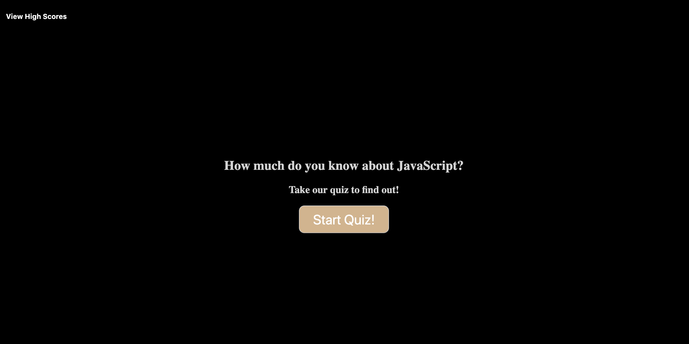
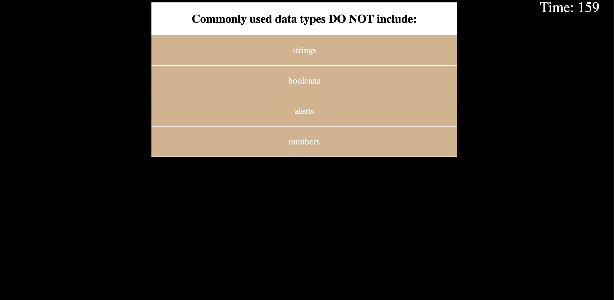
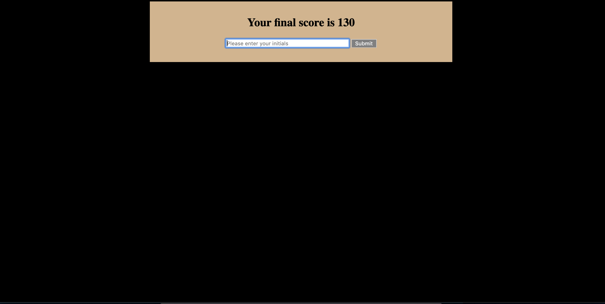
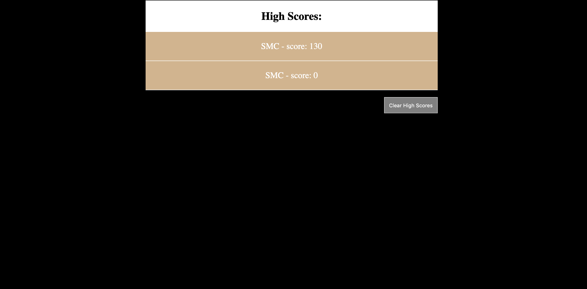

# Code Quiz

The purpose of this appliction is to test users' knowledge about JavaScript.
On the initial screen, user is prompted to begin quiz. Once the start button is pressed, a timer will appear and the user will have 15s per question to complete the quiz. A correct answer will increment the score by one point, an incorrect answer will decrement the time by 5 seconds. Final score is calculated points + time left. Once the timer runs out or the user completes all questions, user will be notified of their final score and prompted to input initials. Their initials will appear on a final scoreboard, sorted from highes to lowest score. User may choose to clear all scores from the scoreboard.

## Home Screen

## Quiz questions 

## Initials prompt

## High Score board
